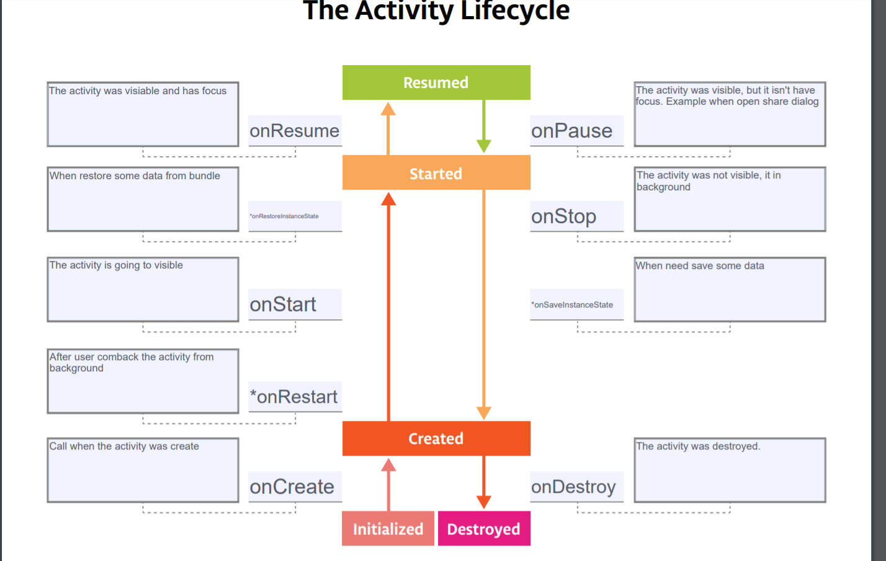

# Activity Lifecycle - DessertPusher 

This is the toy app for lesson 4 of the [Android App Development in Kotlin course on Udacity](https://classroom.udacity.com/courses/ud9012/lessons/e487c600-ed68-4576-a35a-12f211cf032e/concepts/6a155d63-8153-4a56-95cb-1dfdf06aa173).

## DessertPusher

DessertPusher is a game about making desserts. Press the button, make a dessert, earn the big bucks.

This app is for exploring the [Activity Lifecycle callback methods](https://developer.android.com/guide/components/activities/activity-lifecycle) and the [Lifecycle](https://developer.android.com/reference/android/arch/lifecycle/Lifecycle) object.


## Screenshots

  

## The activity life cycle

You can see it at:


- **onResume**: The activity has focus
- **onPause**: The activity lose focus

- **onCreate**: 
  - Inflate the activity UI
  - Inflate the variables
  - Do any other initiazation, which only happen once during the activity life cycle

- **onStart**:
  - Start any sensors, animation or other procedures that need to start when activity visible to user

- **onResume**:
  - Start any sensors, aniamtion or other procedures that need to start when activity has focus

- **onPause**:
  - Stop any sensor, animations or other procedures that need to stop when the activity doesn't focus. Please do it fast, the next activity will not shown until it complete

- **onStop**
  - Stop any sensor, animation or other procudures that need to stop when the activity doesn't on visible on screen.
  - Stop update the layout
- **onDestroy**
  - Tear down or release any resources that related to the activity and aren't automatically release for you. Code update UI after the activity was destroyed will crash app.
  
## The fragment life cycle
Similar with activity life cycle, but it have some other method for its lifecycle
- **onCreate**: Call when the fragment is create. Initialize anythings essential for fragment, do not inflate the layout
- **onCreateView**: When the system draw the fragment for first time. Create your view in here.
- **onActivityCreated**: Call when the onCreate has return and the activity of fragment is initialized. Its purpose is to contain any code, which require the activity existed and it call multi time during the lifecycle of fragment.
- **onStart**: Similar with activity
- **onResume**: Similar with activity
- **onStop**: Similar with activity. You should stop any things need to fragment visible
- **onDestroy**: Call when activity onDestroy called
- **onDestroyView**: When replace it by other view by FragmentManager. You can remove any releated with your view for next draw

## Using LifecycleObserver to handel lifecycle event with itself
Benefits:
- Avoid bug when handle lifecycle event, some code you can missing to do it
- Handle on configuration change

How to use it?
- Make the class (or your activity, fragment) extend **LifecycleObserver**
- Set the lifecycle
```kotlin
  // Register life cycle for class
  lifecycle.addObserver(this)
```
- Make a method with life cycle event by annotation **@OnLifecycleEvent(...)**
```kotlin
  @OnLifecycleEvent(Lifecycle.Event.ON_RESUME)
  fun notifyWhenUserFocus() {
    Timber.d("User come back to your app.")
  }
```
The function **notifyWhenUserFocus** will automatic call when **onResume** callback of activity or fragment was called.
